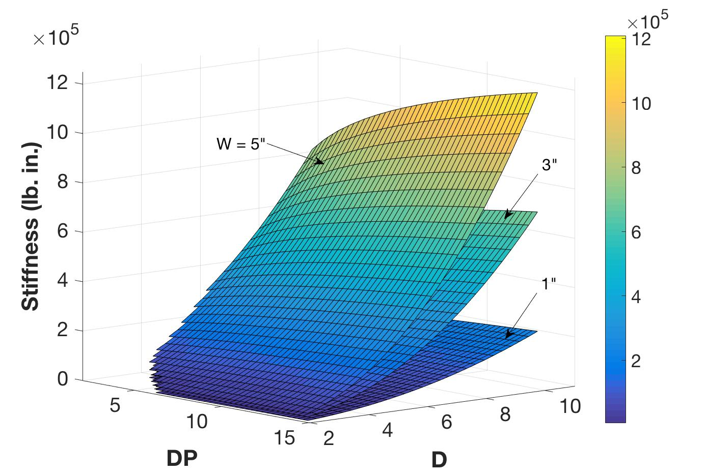
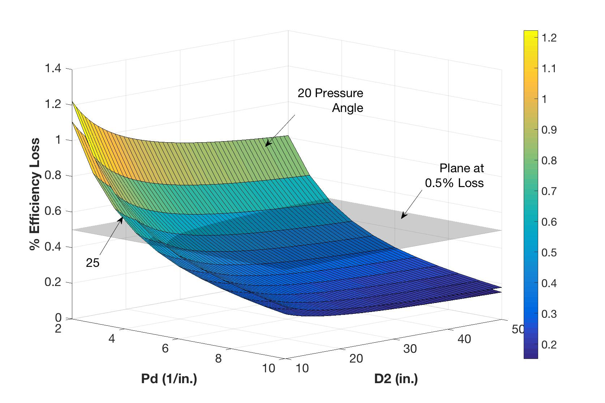
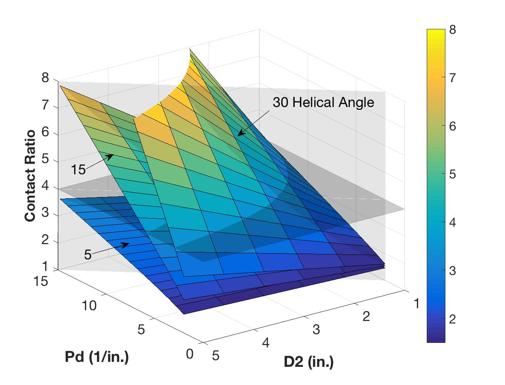
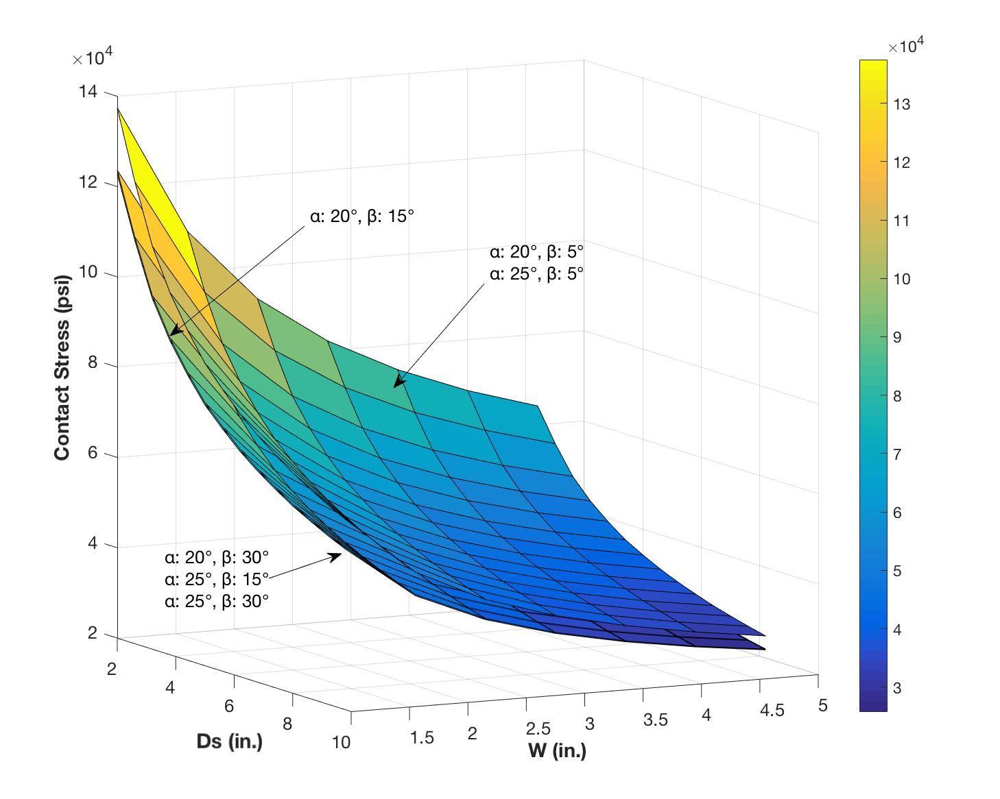

# ActuatorGearing
This code was written while working with Dr. D. Tesar at UT Austin's RRG. From late 2016 to mid 2018 I worked alongside him in various gearing related projects, this code base came in very useful when doing that.

The reason for this kind of library started with work that followed this [thesis](https://repositories.lib.utexas.edu/handle/2152/ETD-UT-2011-05-3562). This code was then used to prototype three rotary actuators and write the document provided [here](https://github.com/LF-luis/ActuatorGearing/blob/master/A%20Parametric%20Design%20Map%20Based%20Approach%20to%20Gearing%20Design.pdf).


Most of the sources for the equations used can be found on the last page of [this document](https://github.com/LF-luis/ActuatorGearing/blob/master/A%20Parametric%20Design%20Map%20Based%20Approach%20to%20Gearing%20Design.pdf).

## Build
- Xcode 10.1
- Swift 3

## Samples of Usage

E.g. calculating total contact ratio of helical gears unsing radial and normal notation.
```swift
// Setup
let pressureAngle: Double = 25.0
let helicalAngle: Double = 30.0
let inFaceWidth: Double = 0.5
let smallGearTeethCnt: Double = 18 // small gear is the driving gear (i.e. pinion)
let smallGearPitchDiameter: Double = 1.22
let largeGearTeethCnt: Double = 28

// Calculations
let diametralPitch: Double = GearEq.diametralPitch(teethCount: smallGearTeethCnt,
                                                   inPitchDiameter: smallGearPitchDiameter)
let largeGearPitchDiameter: Double = largeGearTeethCnt / diametralPitch
let module: Double = GearEq.module(fromDiametralPitch: diametralPitch)

// normal pressure angle
let aN = arcTanD(value: tanD(degrees: pressureAngle) * cosD(degrees: helicalAngle))

// normal module
let inToMm: Double = 25.4 // inches to mm convertion
let radialMod = inToMm / diametralPitch
let normMod = radialMod * cosD(degrees: helicalAngle)

// Output
let radialCR = HelicalGearEq.totalContactRatio(pressureAngle: pressureAngle,
                                               smallGearTeethCnt: smallGearTeethCnt,
                                               largeGearTeethCnt: largeGearTeethCnt,
                                               module: module,
                                               inchFaceWidth: inFaceWidth,
                                               helixAngle: helicalAngle)

let normalCR = NormalHelicalGearEq.totalContactRatio(pitchDiam1: smallGearPitchDiameter * 25.4,
                                                     pitchDiam2: largeGearPitchDiameter * 25.4,
                                                     normaPressAngl: aN,
                                                     helical: helicalAngle,
                                                     normalModule: normMod,
                                                     faceWidth: inFaceWidth * 25.4)

print("Radial contact ratio: ", radialCR)
print("Normal contact ratio: ", normalCR)
```
</br>

E.g. of gearing design maps (the maps were created using Matlab, but all the calculations came from this codebase):
<table>
  <tr>
    <th> Stiffness as a Function of Diametral Pitch and Pitch Diameter </th>
    <th> Torque Amplifier Percent Efficiency Loss, 20° and 25° Pressure Angle, f = 0.05</th>
  </tr>
  <tr>
    <th>
      
    </th>
    <th>
      
    </th>
  </tr>
  <tr>
    <th>Contact Ratio for Helical Gear Mesh, 25° Pressure Angle</th>
    <th>Contact Stress for 20° and 25° Pressure Angle, Velocity Amplifying Gear Meshes</th>
  </tr>
  <tr>
    <th>
      
    </th>
    <th>
      
    </th>
  </tr>
</table>
